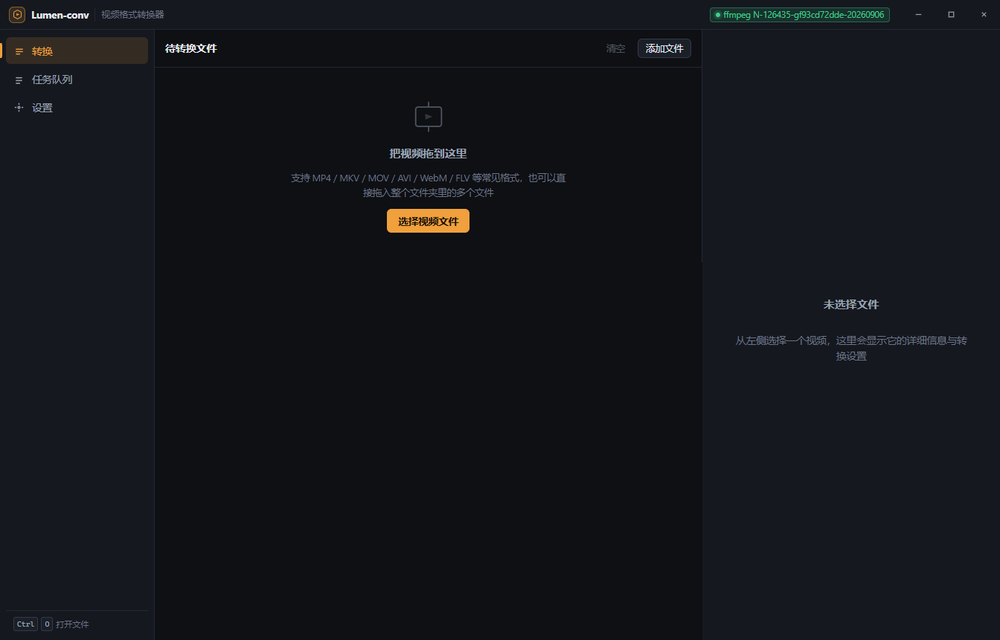
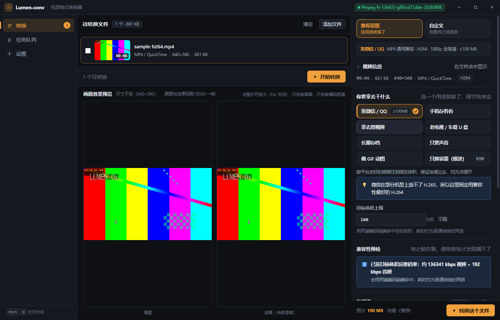
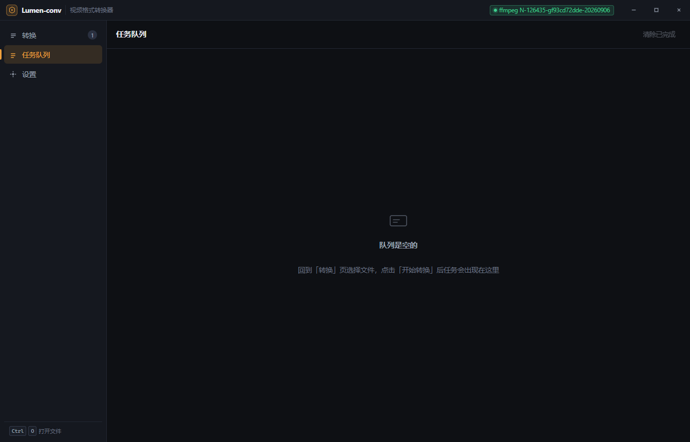
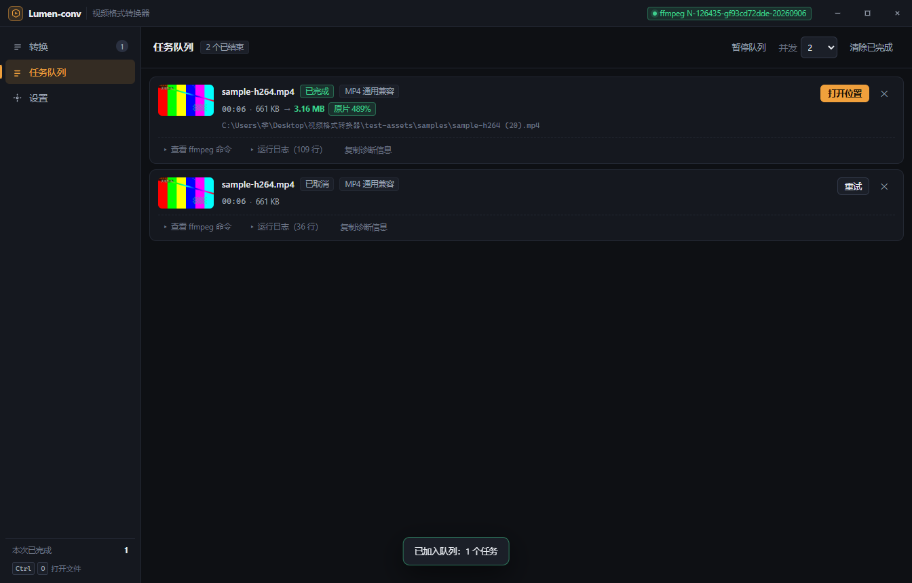
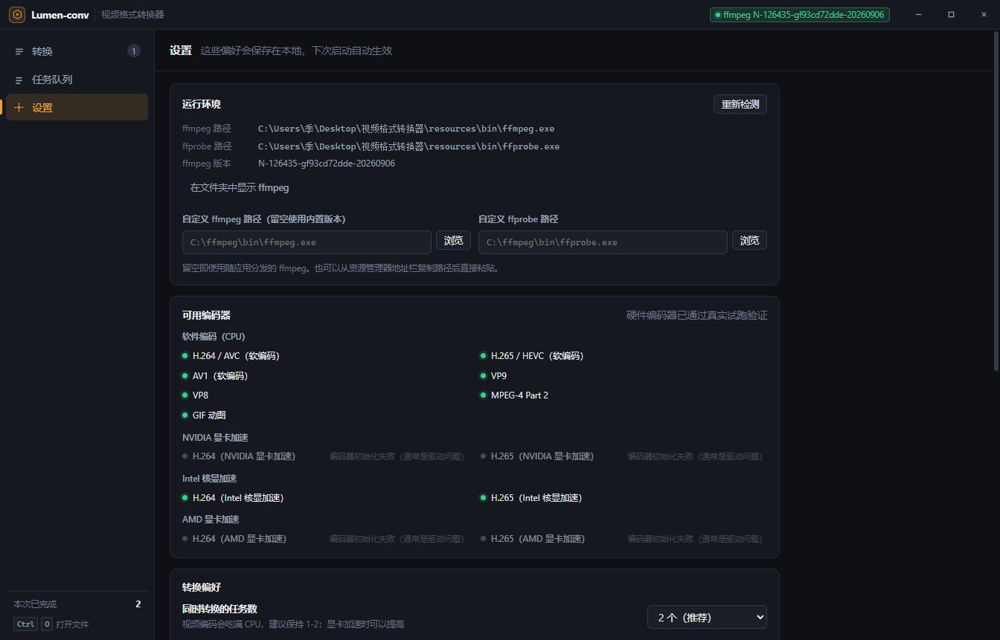
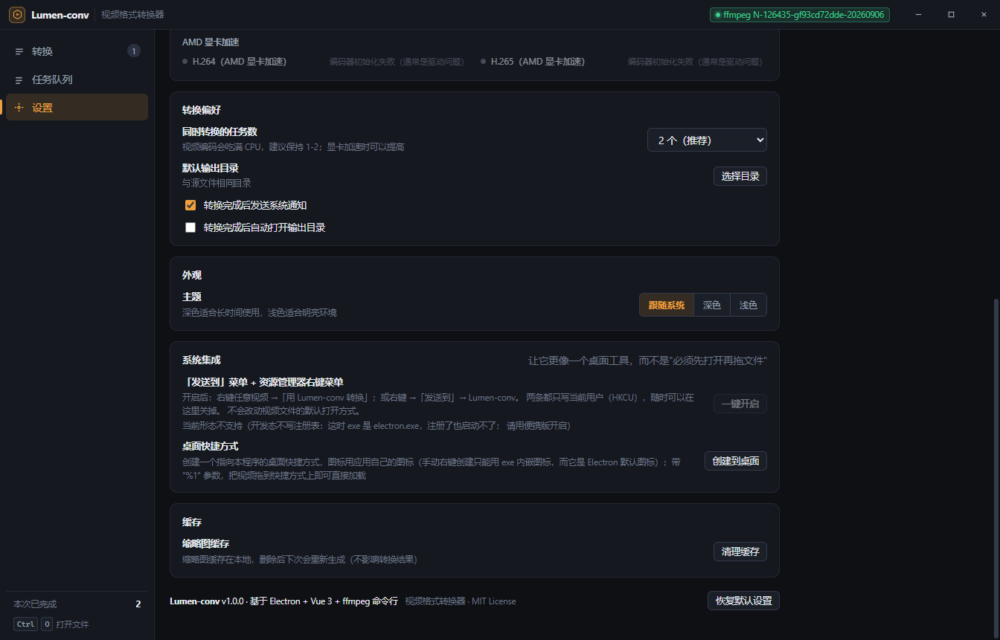
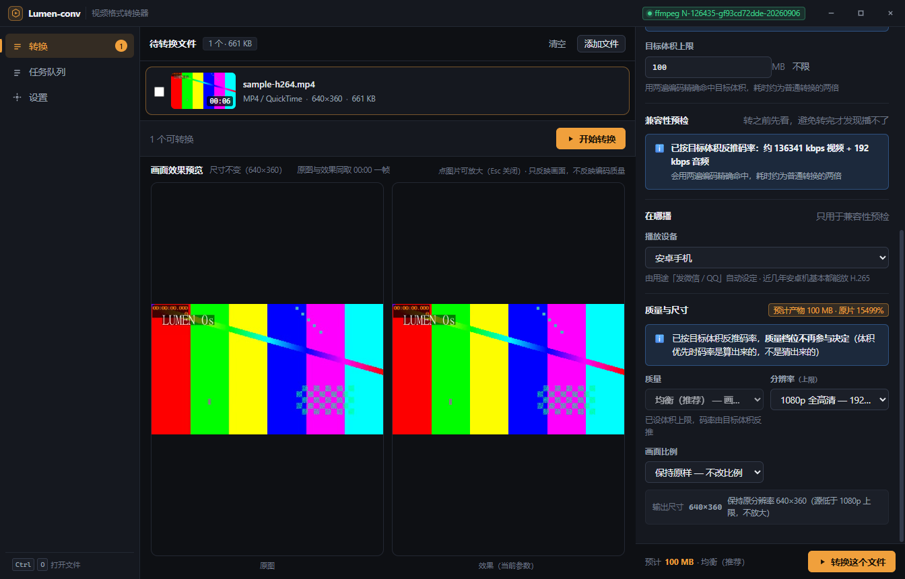
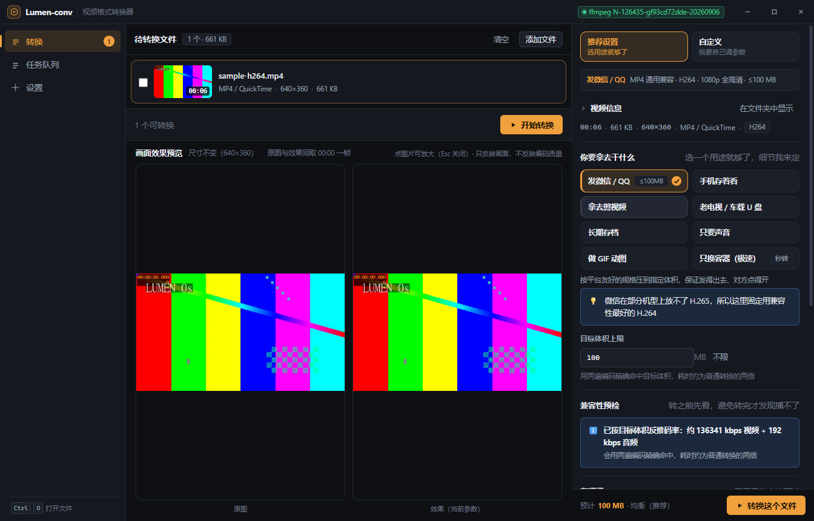
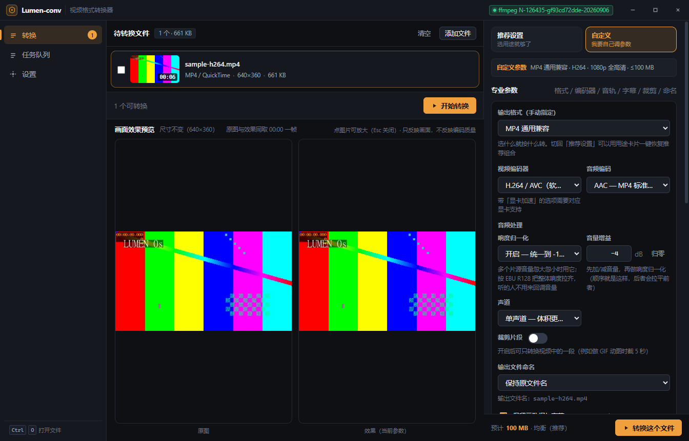
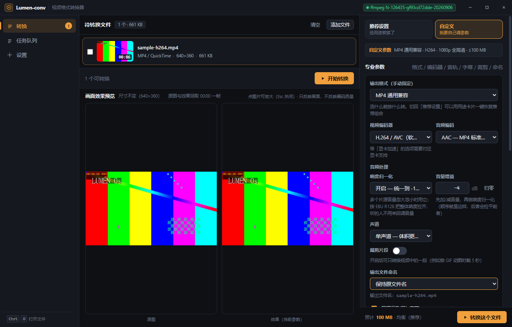

# Lumen-conv 视频格式转换器

> 一个 Windows 桌面视频格式转换器：拖入视频 → 看到信息与封面 → 选一个预设 → 转换并实时看进度。
> 基于 Electron + Vue 3 + TypeScript，转换能力全部由 ffmpeg 命令行提供。

- **产品名**：Lumen-conv 视频格式转换器
- **包名 / 版本**：`lumen-conv` 1.0.0
- **平台**：Windows x64（打包产物：`release/Lumen-conv-便携版/` 离线便携版；NSIS 安装包需在有网络的环境构建）
- **License**：MIT
- **仓库**：`git@github.com:xiaomingliang927/Lumen-conv.git`

---

## 直接下载（不想自己构建）

**便携版（Windows，解压即用）** —— 三个附件按需选一个：

| 附件 | 大小 | 适合谁 |
| --- | --- | --- |
| [`Lumen-conv-portable-v1.0.0.7z`](https://github.com/xiaomingliang927/Lumen-conv/releases/download/v1.0.0/Lumen-conv-portable-v1.0.0.7z) | **153.6 MB** | **推荐**。完整版、体积最小。Windows 11 资源管理器可直接解压；Windows 10 需装 7-Zip / Bandizip / WinRAR |
| [`Lumen-conv-portable-v1.0.0.zip`](https://github.com/xiaomingliang927/Lumen-conv/releases/download/v1.0.0/Lumen-conv-portable-v1.0.0.zip) | 227.4 MB | 完整版、通用格式，任何解压工具都能开 |
| [`Lumen-conv-slim-v1.0.0.zip`](https://github.com/xiaomingliang927/Lumen-conv/releases/download/v1.0.0/Lumen-conv-slim-v1.0.0.zip) | 119.5 MB | **精简版**：不内置 ffmpeg，首次运行需在「设置 → 运行环境」指定你自己的 ffmpeg 路径 |

完整版**解压即用**：解压到任意目录，双击 `Lumen-conv.exe`，无需安装、也无需另装 ffmpeg。

> **下载慢怎么办（本机实测，直连慢到不可用）**
>
> | 通道 | 实测速度 | 下完 153.6 MB 需要 |
> | --- | --- | --- |
> | 直连 GitHub | 0.02 MB/s | **约 142 分钟** |
> | `https://ghfast.top/` | 0.09 MB/s | 约 27 分钟 |
> | `https://gh-proxy.com/` | **0.59 MB/s** | **约 4.4 分钟** |
>
> 用法就是把原始地址**接在镜像后面**。推荐附件（`.7z`）的两个加速地址：
>
> ```
> https://gh-proxy.com/https://github.com/xiaomingliang927/Lumen-conv/releases/download/v1.0.0/Lumen-conv-portable-v1.0.0.7z
> https://ghfast.top/https://github.com/xiaomingliang927/Lumen-conv/releases/download/v1.0.0/Lumen-conv-portable-v1.0.0.7z
> ```
>
> 换成别的附件名就是另外两个包（`-portable-v1.0.0.zip` / `-slim-v1.0.0.zip`）。
>
> ⚠️ 速度是**在开发这台机器上实测**的，不同网络/时段差别很大，请以你本地为准；
> 两个镜像都验证过内容正确（HTTP 206 + 文件头魔数 + 大小一致），
> 但**第三方镜像会看到你的下载流量**，介意的话可以用最小的 `.7z` 直连慢慢下。

<details>
<summary>为什么 .7z 比 .zip 小 83 MB（点开看构成）</summary>

实测 zip（227.4 MB）里的压缩后占用：

| 压缩后 | 内容 |
| --- | --- |
| 86.8 MB | Electron 主程序 `Lumen-conv.exe`（框架自带，省不掉） |
| 53.5 MB | `ffmpeg.exe`（转换引擎） |
| 53.4 MB | `ffprobe.exe`（媒体信息探测） |
| 9.8 MB | `dxcompiler.dll`（Chromium 的 D3D12 着色器编译） |
| ~33 MB | 其余 dll / pak / icudtl 等 |

两个 ffmpeg 二进制合计 107 MB，是除了框架之外的最大项。
改用 **7z（LZMA2）** 重压后整体降到 153.6 MB —— 同样的内容，只是压缩算法更强。
另外打包脚本会自动**精简语言包**（Electron 自带 55 个 `.pak` 共 43.7 MB，本应用全中文界面，
只保留 zh-CN / en-US / en-GB，省下 42 MB）。
</details>

完整发布说明见 [Releases](https://github.com/xiaomingliang927/Lumen-conv/releases/tag/v1.0.0)。
想自己构建或改用"精简版"见下方「安装」与「打包」。

---

## 界面截图

以下 **10 张**截图位于 `docs/screenshots/`，**全部由界面自检命令自动生成**
（启动真实 Electron 窗口 → 加载真实视频 → 逐页断言并截图 → **在应用内真的点一次「开始转换」并等任务跑完**），
不是手工摆拍的。它们分**两步**产出（原因见下方 `queue.png` 的说明）：

```bash
# 第 1 步：产出 main.png / main-with-file.png / size-plan.png / mode-recommended.png
#          / mode-custom.png / main-advanced.png / queue.png（空队列）/ settings.png
#          / settings-shell.png（设置页下半部分「系统集成」）
npm run smoke:ui:file

# 第 2 步：额外产出 queue-done.png（有任务），不会覆盖第 1 步的 queue.png
npm run smoke:ui:full
```



*转换页空状态：引导语与「选择视频文件」按钮，右侧为"未选择文件"提示。*



*转换页加载真实视频后：左侧文件卡片带**智能选帧缩略图**与时长角标；
中间栏是**画面效果预览**——左「原图」右「效果（当前参数）」并排，标题写明
「原图与效果同取 00:00 一帧」（两张图**必须**取自同一帧，否则"对比"不成立；自检会断言缩略图帧 == 预览帧），
可点任意一张放大到整屏，Esc 关闭；
右侧是**推荐设置**模式：视频信息收成一行摘要（`00:06 · 661 KB · 640×360 · MP4 / QuickTime · H264`，
点「在文件夹中显示」可展开完整明细）、8 张用途卡片（当前选中「发微信 / QQ」，体积上限 100 MB）、
「目标体积上限」与「兼容性预检」；底部为「预计 100 MB · 均衡（推荐）」与「转换这个文件」。*



*任务队列页（**空队列**形态，约 22 KB）：**一条任务都没有**，
队列区显示空状态引导「队列是空的 / 回到「转换」页选择文件，点击「开始转换」后任务会出现在这里」，
右上角「清除已完成」为禁用态；有任务时的形态见下一张。*



***真实转换完成后**的队列页（约 54 KB）——
这是"在界面上点一次按钮真的能转完一个文件"的证据：
标题为「任务队列 · 2 个已结束」，任务 `sample-h264.mp4` 状态「已完成」、预设「MP4 通用兼容」、耗时 `00:06`、
**`661 KB → 3.15 MB`**（本次自检用的用途是「发微信 / QQ」，体积上限 100 MB 远大于这个 6.6 秒样本，
所以产物比原片大——**上限是"不许超过"，不是"目标值"**；换成「极小体积」一档即 `661 KB → 250 KB`），
输出路径为 `test-assets\samples\sample-h264 (2).mp4`，
展开区可查看 ffmpeg 命令与 **57 行**运行日志，右侧是「打开位置」按钮。
任务卡片上的状态徽标、"源大小 → 产物大小（占原片百分比）"、失败/取消任务的
「重试 / 复制诊断信息 / 打开位置」都在这一张里。
图中第二张「已取消」卡片来自自检脚本清理队列的动作（`engine.remove()` 对正在运行的任务会先 `cancel()`），
不是手工操作产生的。*

> 这两张图**内容不同**（sha256 不同），可以互相印证：`queue.png` 是空队列，
> `queue-done.png` 有任务。早期版本里 `smoke:ui:full` 会在转换完成后再截一次 `queue.png`，
> 把空队列那张覆盖成同一张图（两个文件 sha256 相同），现已修复——转换跑过时**不再写 `queue.png`**，
> 只在它不存在时给出提示。
>
> 关于文件大小：`queue.png` 是稳定的 22,942 字节（空队列没有时间信息，每次逐字节相同）；
> `queue-done.png` 会在 54–58 KB 之间小幅波动，因为任务卡片上显示「已用时」，截图瞬间的秒数不同。
> 内容语义完全一致（状态「已完成」、产物 3.15 MB、可展开命令与日志），所以这里只标注约数。



*设置页：ffmpeg / ffprobe 实际路径与版本、每个编码器的可用性（硬件编码器为**真实试跑**结果）、
转换偏好、主题与缓存清理。这一页信息量最大，能直接反映运行环境是否正常。*



*设置页下半部分的「系统集成」：「发送到」菜单 + 资源管理器右键菜单开关、创建桌面快捷方式。
设置页比窗口高，`settings.png` 一屏截不到这里，所以自检会滚到该卡片再拍一张 ——
并且**校验它真的进了视口**，滚不到就直接失败退出，不留一张"看着像设置页、其实没拍到"的错图。
注意图上写的是「当前形态不支持（开发态不写注册表…请用便携版开启）」：这是**有意为之的安全行为**，
开发态的 exe 是 `electron.exe`，注册了只会启动一个裸 Electron；打包版里这里是可点的「一键开启」。*

### 「输出尺寸」与「画面比例」



*「在哪播」里的播放设备**由用途自动带出**（图上写着"由用途「发微信 / QQ」自动设定"）；
「质量与尺寸」里直接写出**实际输出尺寸**（`640×360`，并说明源低于 1080p 上限所以不放大），
下面就是「画面比例」选项。*

> 这一行是修一条真实反馈留下的：用户说"我换成手机的但是屏幕比例没变"——
> 因为 1080p 是**上限**，640×360 的源选它并不会放大，而旧界面只写「1080p 全高清」，
> 等于**显示了一个它不会产出的分辨率**。现在显示的数字与 ffmpeg 的滤镜链读同一份计算
> （`shared/output-size.ts`），不可能再对不上。详见 [docs/DECISIONS.md](docs/DECISIONS.md) D-021。

### 两种模式的差别，第一眼就能看见

同一个文件、同一次运行，只切了右上角的模式开关——左「推荐设置」、右「自定义」：




*左边「推荐设置」是**选用途**（8 张卡片 + "选一个用途就够了，细节我来定"）；
右边「自定义」是**纯参数界面**——用途卡片整块消失，专业参数直接铺开，参数在前、信息与预检在后。*



*「自定义」模式下的专业参数字段：输出格式 / 编码器 / 音轨 / 字幕 / 裁剪 / 命名 / 帧率 / 画面比例。
自检会断言这些字段**不横向溢出**（实测最宽元素 `field@336`，面板宽 400px）。*

> 这两张图是**被真实用户反馈逼出来的**，而且是两轮：
> 第一轮"推荐设置和自定义没区别啊"——当时两种模式的差异全在折叠线以下；
> 第二轮"自定义不要这个推荐，缺少专业性，这个用最初那个版本自己调整更合适"——
> 于是自定义模式彻底去掉了推荐卡片。
> 自检现在直接断言"自定义模式不出现用途推荐卡片"（实测 **0 张**）与
> "推荐模式用途卡片齐全"（实测 **8 张**），并把两种模式的首屏区块都打印出来。
> 完整取舍见 [docs/DECISIONS.md](docs/DECISIONS.md) 的 D-018 与 D-019。

> 说明：`docs/screenshots/` 下的 10 张 PNG 由上面那两步命令**自动生成并覆盖**
> （第 1 步出 `main` / `main-with-file` / `mode-*` / `main-advanced` / `queue` / `settings` / `settings-shell`，
> 第 2 步出 `queue-done.png`），
> `smoke:ui:full` 一级同时执行 **84 项**界面断言（断言内容见 [docs/TEST_CASES.md](docs/TEST_CASES.md) 的 A7 / A8 / B0 节，
> 截图清单见 [docs/screenshots/README.md](docs/screenshots/README.md)）。
> 在你本地首次跑出截图之前，上面的图片引用会是空链接。

---

## 项目由来

本项目是一道线上笔试题的交付物，限时三天。原始需求共 7 条（见下方[功能特性](#功能特性对照原始需求)逐条对照），核心考察点不是"能不能调通一个转码命令"，而是**工程能力**：技术选型是否站得住、边界情况是否有处理、做出来的东西开发者自己愿不愿意用。

关于开发过程中的取舍、踩到的环境问题、以及哪些部分是实机验证过的、哪些还没有，都记录在：

| 文档 | 内容 |
| --- | --- |
| [docs/FEATURES_AND_ROADMAP.md](docs/FEATURES_AND_ROADMAP.md) | **功能清单与后续优化方向**：现在能做什么（逐项含实现位置）、怎么打包运行、以及 20 条按投入产出比排序的优化项 |
| [docs/SESSION_SUMMARY.md](docs/SESSION_SUMMARY.md) | 会话总结：分阶段做了什么、交付了什么、验证到什么程度、遗留问题；第 5 节按"已修复 / 仍然存在"列出代码审查发现 |
| [docs/DECISIONS.md](docs/DECISIONS.md) | 决策日志（ADR 风格）：17 条关键决策的备选方案与代价 |
| [docs/FEEDBACK_LOG.md](docs/FEEDBACK_LOG.md) | 反馈记录：人类给出的要求与 AI 的响应落地情况 |
| [docs/CORE_IMPLEMENTATION.md](docs/CORE_IMPLEMENTATION.md) | 核心实现说明：GIF 单进程调色板链、界面自检三级命令、安全模型等 |
| [docs/TEST_CASES.md](docs/TEST_CASES.md) | 边界与异常用例：A 部分自动化覆盖、B 部分需人工确认 |

---

## 功能特性（对照原始需求）

### 需求 1：加载视频信息并显示缩略图

- **信息探测**：调用 `ffprobe -print_format json -show_format -show_streams -show_chapters`，一次拿到全部信息，
  解析为结构化数据：时长、分辨率、帧率（`avg_frame_rate` 优先于 `r_frame_rate`）、码率、编码器与 profile、
  像素格式与位深、HDR 判定、旋转角、音轨（声道/采样率/语言/是否默认）、字幕（文本型 / 图形型）、章节、容器级元数据。
  - 显示尺寸会按 `sample_aspect_ratio`（非方形像素，DVD/老手机视频常见）与旋转角校正，避免界面上出现压扁的比例。
  - 代码：`electron/ffmpeg/probe.ts`
- **缩略图**：默认走"智能选帧"而不是固定时间点抽帧。
  1. 先用 `blackdetect=d=0.1:pix_th=0.10` 扫描**前 60 秒**，找出片头黑场区间；
  2. 在 10% / 25% / 50% / 5% 以及 2 秒处生成候选时间点，落在黑场区间内的候选点顺延到黑场结束后 0.4 秒；
  3. 逐个抽帧，并用 `signalstats` 取平均亮度 `YAVG`，低于 12 视为仍然是黑帧，换下一个候选点；
  4. 结果按 **SHA1(路径 + 文件大小 + 修改时间 + 目标宽度)** 做磁盘缓存，二次进入应用时秒出。
  - 代码：`electron/ffmpeg/thumbnail.ts`
- **并行与预热**：探测完成后立即在后台预热缩略图（`main.ts` 的 `media:probe` 处理器），用户还没点开，图已经在算；
  一次拖入多个文件时探测并发上限为 3，避免把 ffprobe 打爆（`renderer/composables/useStore.ts`）。

### 需求 2：用 ffmpeg 命令行完成转换

- **全部转换都是命令行调用**，通过 `spawn(可执行文件, 参数数组)` 直接执行，**不经过 shell**（`electron/ffmpeg/process.ts`）。
- UI 上的选项是**结构化参数**，由 `buildCommand()` 翻译成 ffmpeg 参数数组（`electron/ffmpeg/commands.ts`）。
  UI 改一个滑杆只影响一个参数，而不是拼接字符串。
- 支持 **7 种输出容器**：MP4 / MKV / WebM / GIF / MP3 / M4A / 原样重封装；内置 **9 个转换预设**（见 `shared/presets.ts`）。
- 界面上每个任务都能**展开查看完整 ffmpeg 命令原文**（任务队列 →「查看 ffmpeg 命令」），
  这是"确实在用命令行"最直接的证据，也方便用户自查参数。

| 预设 | 输出 | 说明 |
| --- | --- | --- |
| MP4 通用兼容 | MP4 | H.264 + AAC，最稳的选择 |
| MP4 1080p 压缩 | MP4 | 压到 1080p，体积明显变小 |
| H.265 小体积（MP4） | MP4 | HEVC，同画质约为 H.264 的 60% |
| WebM 网页视频 | WebM | VP9 + Opus |
| MKV 收藏（多音轨 + 字幕） | MKV | 音轨与字幕直通 |
| 极速换壳（不重编码） | MP4 | `-c copy`，几秒完成 |
| 导出 MP3 音频 | MP3 | 只保留声音 |
| 导出 M4A 音频 | M4A | AAC 编码 |
| GIF 动图 | GIF | 调色板两遍法 |

### 需求 3：自主优化

以下 12 项是在满足基本需求之外自己加的，逐条都能在代码里找到对应实现：

| # | 优化 | 解决的问题 | 代码位置 |
| --- | --- | --- | --- |
| 1 | 硬件加速**真实试跑**探测 | `ffmpeg -encoders` 列表里永远有 nvenc/qsv/amf，只看列表会让用户选了显卡加速后立刻报错。这里对每个硬件编码器真的跑一次 0.2 秒空转编码（`lavfi` 合成 6 帧黑帧）来验证 | `capabilities.ts` |
| 2 | 智能选帧缩略图 + 磁盘缓存 | 固定时间点抽帧会抽到片头黑场/台标黑屏 | `thumbnail.ts` |
| 3 | 取消时杀**进程树**并清理半成品 | 只 kill 父进程会残留 ffmpeg 子进程继续吃 CPU；取消后用户会看到一堆 0 字节 `.mp4` | `process.ts`（Windows 用 `taskkill /pid <pid> /T /F`）、`convert.ts` 的 `cleanupPartial()` |
| 4 | 输出文件自动改名 / 磁盘空间预检 / 产物偏小告警 | 不覆盖用户已有文件；提前拦住"转完 3 小时发现磁盘满"；输出小于预估 5% 时提示播放确认 | `convert.ts` 的 `resolveOutputPath()`、`errors.ts` 的 `estimateOutputBytes()` |
| 5 | ffmpeg 错误翻译成人话 + 给修复建议 | 用户不该看到 `Failed to configure output pad on Parsed_scale_1` | `errors.ts`（11 条规则，含"源编码装不进目标容器，请改用会重新编码的预设"），同时保留原始日志可展开、可复制 |
| 6 | HDR 色调映射；旋转**交由 ffmpeg 自动转正**（不手动 `transpose`） | HDR 片源转 8bit 编码器会发灰；而旋转若手动再转一次会**转两次互相抵消**，产物退回竖版且丢旋转标记 —— 这个坑已实测并修正，详见 `docs/TEST_CASES.md` 的 A9 | `commands.ts`（`zscale`/`tonemap=hable` 链；旋转只提示不处理） |
| 7 | 目标分辨率高于源时**只缩不放** | 无意义放大只会变糊且浪费体积，UI 上会明确提示"已自动保持原分辨率" | `commands.ts` |
| 8 | GIF 用**调色板两遍法** | ffmpeg 默认 GIF 转换只有 256 色且画质差，`palettegen` + `paletteuse` 明显更好 | `commands.ts` |
| 9 | 直通（`-c copy`）前预检容器兼容性 | 源编码装不进目标容器时，ffmpeg 会在最后一步才失败，用户白等一场 | `commands.ts` 的 `isCodecAllowedInContainer()` |
| 10 | MP4 加 `-movflags +faststart` | 索引前置，网页可边下边播 | `commands.ts` |
| 11 | 启动先"快速探测"再后台完整探测 | 界面秒出，不阻塞在硬件编码器试跑上；完整结果通过 `capabilities:updated` 事件推回来刷新 UI | `main.ts`、`capabilities.ts` |
| 12 | 自定义协议 `lumen-media://` 提供本地文件访问 | 不用关 `webSecurity`，也不用把缩略图读成 base64 塞进内存 | `main.ts` |

另外还有几处工程细节：`windowsHide: true`（否则 Windows 上每执行一次 ffmpeg 都闪一个黑窗口）、
每个 ffmpeg/ffprobe 进程都带超时兜底、单任务日志上限 500 行 / stderr 只保留尾部 64 KB 防止长视频把内存吃满、
设置文件用"临时文件 + rename"原子写入避免崩溃后设置全丢。

### 需求 4：会话总结 + 开发者决策与反馈记录

即本仓库 `docs/` 下的文档：`SESSION_SUMMARY.md`（会话总结）、`DECISIONS.md`（决策日志，D-001 … D-027）、
`FEEDBACK_LOG.md`（反馈记录）、`CORE_IMPLEMENTATION.md`（核心实现说明）、`TEST_CASES.md`（边界与异常用例）。
其中 SESSION_SUMMARY 明确区分了"已实机验证"与"尚未验证"的部分，并把代码缺陷按"已修复 / 仍然存在"两部分列出。

### 需求 5：项目提交 GitHub

远端：`git@github.com:xiaomingliang927/Lumen-conv.git`。远端原本只有一个内容为 `# Lumen-conv` 的 README，
已重命名为 `README.upstream.md` 保留（本文件是新写的项目主文档）。

> 提交状态与推送注意事项见 [docs/SESSION_SUMMARY.md](docs/SESSION_SUMMARY.md) 的"交付状态"一节。

### 需求 6：界面选型必须与"客户端"强关联

选 **Electron**：它产出的是真正的 Windows 桌面应用，而不是套壳网页或命令行工具。具体体现：

- 自绘标题栏 + 原生窗口控制（最小化 / 最大化 / 关闭），`autoHideMenuBar`，单实例锁（第二次启动聚焦已有窗口而不是再开一个）。
- 操作系统级集成：系统文件选择对话框、`shell.showItemInFolder` 打开输出位置、转换完成系统通知、拖拽文件从资源管理器直接入列表。
- 打包为 NSIS 安装包 / portable 单文件，有桌面与开始菜单快捷方式。
- 独立进程模型：ffmpeg 作为子进程运行，渲染进程崩溃不影响正在跑的转换任务。

为什么不是 Tauri / PySide6 / WPF，以及本机环境探测结果如何影响这个决策，见 [docs/DECISIONS.md](docs/DECISIONS.md) 的 D-001。

### 需求 7：做给人用的东西

| 场景 | 处理方式 |
| --- | --- |
| 添加文件 | 整个文件区都可以拖入（不用精准对准虚线框），有拖拽覆盖提示；也支持「添加文件」和 `Ctrl+O` |
| 空状态 | 文件列表、任务队列都有插图 + 一句"该做什么"的引导，而不是空白页 |
| 分析中 | 缩略图位置显示骨架屏，文本显示"正在读取视频信息…"，不是转圈假死 |
| 单个文件失败 | 该条目标红并显示原因，"开始转换"只统计可转换的文件，不拖累其他文件 |
| 任务失败 | 不只说失败：给**原因 + 修复建议**，并提供「重试」「复制诊断信息」「打开位置」，原始日志可折叠、可选中复制 |
| 参数不理解 | 每个预设、编码器、质量档位、分辨率都带一句人话说明；预设还有 `tip` 提示条（如"H.265 部分老旧设备不支持"） |
| 不知道会转出多大 | 改任何参数都实时显示**预计体积**与相对源文件的压缩比 |
| 怕选错 | **两种模式**：默认「推荐设置」只露"用途 / 在哪播 / 质量与尺寸"三层，字幕、音轨、裁剪、文件名模板折叠进「专业参数」；切到「自定义」才出现这个入口。模式选择会记住，不用每次重选 |
| 看不出两种模式的差别 | 模式切换正下方有一行**当前方案摘要**（如 `发微信 / QQ · MP4 通用兼容 · H264 · 1080p 全高清 · ≤100 MB`），切模式立刻变化；自定义模式**首屏最上面**就是「专业参数」入口，推荐模式下它整个不存在。<br>这两点是被真实用户反馈逼出来的（原话"推荐设置和自定义没区别啊"）——原来的实现里差异全在折叠线以下，见 `docs/DECISIONS.md` D-018 |
| 视频信息太长 | 默认收起成一行摘要（`00:06 · 661 KB · 640×360 · MP4 / QuickTime · H264`），点标题展开才是完整 8 行明细——把首屏让给真正要做的决策 |
| 环境有问题 | 设置页有「运行环境」与「可用编码器」两块诊断区，显示 ffmpeg **实际路径**、版本、以及每个编码器的可用性与不可用原因；ffmpeg 缺失时主界面顶部有醒目横幅直接引导到设置页 |
| 长时间等待 | 队列显示百分比 + 速度 + 剩余时间 + 已用时，有本地 1 秒心跳保证时间持续走动；完成后可发系统通知 |
| 视觉偏好 | 深浅色主题（跟随系统 / 深色 / 浅色），浅色下代码块有单独的配色 |
| 语言 | 全中文文案，包括 ffmpeg 报错的翻译 |
| 快捷键 | `Ctrl+O` 添加文件、`Ctrl+1/2/3` 切换转换/队列/设置页 |
| 不想从窗口里找文件 | **把文件拖到 exe 图标上**、右键「**用 Lumen-conv 转换**」、或「发送到 → Lumen-conv」—— 应用没开着就直接启动并加载，已经开着就唤起现有窗口并加载（设置页可一键开关，只写当前用户、可撤销） |
| 音量忽大忽小 | 「专业参数 → 音频处理」：**响度归一化**（EBU R128，统一到 -16 LUFS）、音量增益（±30 dB）、声道（单声道 / 立体声） |
| 对方设备不显示字幕 | 「专业参数 → 字幕轨道 → **烧进画面**」把字幕画进像素，任何设备都能看到（代价：必须重新编码、不可撤销；直通模式与图形字幕会被当场拦下） |
| 批量转换要排队 | 队列页可**暂停/继续**（暂停 = 不启动新任务，跑着的跑完）、**置顶/上移/下移**调整顺序、直接选并发数、看总剩余时间；开转前还会检查目标盘空间够不够 |
| 不知道改完长什么样 | 中间栏的「**画面效果预览**」：左「原图」右「效果」，同一帧直接对比，**可点击放大到整屏**（能看尺寸/比例/补边/字幕；**不反映编码质量**——那是「预计体积」的事） |
| 只想先试试，不想下 600 MB | `npm run dist:portable:slim` 产出**精简版**（324 MB，不内置 ffmpeg）：首次运行按顶部提示指定你自己的 ffmpeg 路径即可 |

> 说明：快捷键在 `renderer/App.vue` 中实现，但界面上目前没有文字提示（只在代码注释里），新用户不易发现。

---

## 技术栈

| 层 | 选型 | 实际安装版本 | package.json 声明 |
| --- | --- | --- | --- |
| 桌面运行时 | Electron | 38.8.6 | `^38.8.6` |
| 前端框架 | Vue 3（`<script setup>` + 组合式 API） | 3.5.42 | `^3.5.42` |
| 渲染层构建 | Vite | 7.3.6 | `^7.3.6` |
| 语言 | TypeScript（`strict: true`） | 5.9.3 | `^5.9.3` |
| 主进程/preload 打包 | esbuild（bundle → CJS 单文件） | 0.28.2 | `^0.28.2` |
| 类型检查 | vue-tsc | 3.3.11 | `^3.3.11` |
| 打包分发 | electron-builder（NSIS + portable） | 26.15.3 | `^26.15.3` |
| 并行启动 | concurrently | 10.0.5 | `^10.0.5` |
| 转码内核 | ffmpeg / ffprobe 命令行 | 见下文 | 随应用分发 |

不使用的前端依赖：**没有 Pinia**（自研状态中心够用）、**没有 UI 组件库**（界面完全手写，无第三方组件依赖）、没有 fluent-ffmpeg（直接调命令行）。

## 架构

```
┌───────────────────────────────────────────────────────────────────────────┐
│ 渲染进程 Renderer  (Vue 3 + TS)                          renderer/        │
│                                                                           │
│   App.vue ──┬── TitleBar.vue      自绘标题栏 / 窗口控制                    │
│             ├── Sidebar.vue       转换 · 任务队列 · 设置                   │
│             ├── FileList.vue      待转换文件（拖拽入列 / 骨架屏 / 封面）    │
│             ├── DetailsPanel.vue  视频信息 + 输出格式 + 质量尺寸 + 专业参数 │
│             ├── JobQueue.vue      进度 / 命令原文 / 日志 / 失败处理         │
│             └── SettingsView.vue  运行环境诊断 · 编码器可用性 · 偏好 · 缓存 │
│                                                                           │
│   composables/useStore.ts   自研状态中心（ref + computed，模块级单例）      │
│   utils/format.ts           时长/体积/码率/语言等展示格式化                │
└──────────────────────────────────┬────────────────────────────────────────┘
                                   │  window.converter.*   ← 唯一出口
                                   │  invoke 请求 + on* 事件订阅
┌──────────────────────────────────▼────────────────────────────────────────┐
│ preload.ts   contextBridge 暴露白名单 API                                 │
│              contextIsolation: true · nodeIntegration: false              │
└──────────────────────────────────┬────────────────────────────────────────┘
                                   │  ipcMain.handle / webContents.send
┌──────────────────────────────────▼────────────────────────────────────────┐
│ 主进程 Main  (Node)                                    electron/          │
│                                                                           │
│   main.ts          窗口 · IPC 路由 · lumen-media:// 协议 · 生命周期        │
│   settings.ts      settings.json 持久化（临时文件 + rename 原子写）        │
│   ffmpeg/                                                                 │
│     binaries.ts      二进制定位：用户自定义 > 随应用分发 > 系统 PATH        │
│     process.ts       子进程封装：spawn 数组 / 杀进程树 / 超时 / 行回调      │
│     probe.ts         ffprobe JSON → 结构化媒体信息                        │
│     thumbnail.ts     智能选帧 + 磁盘缓存                                  │
│     commands.ts      结构化选项 → ffmpeg 参数数组（核心模块）              │
│     progress.ts      解析 -progress pipe:1 → 百分比/速度/剩余时间          │
│     capabilities.ts  编码器能力探测（硬件编码器真实试跑）                   │
│     errors.ts        ffmpeg stderr → 人话结论 + 修复建议                   │
│     convert.ts       任务引擎：队列 / 并发 / 取消 / 重试 / 磁盘预检         │
└───────┬───────────────────────────────────────┬───────────────────────────┘
        │ spawn(exe, args)  不经 shell          │ 引用同一份类型
        ▼                                       ▼
┌──────────────────────────────┐   ┌────────────────────────────────────────┐
│ resources/bin/               │   │ shared/                                │
│   ffmpeg.exe                 │   │   types.ts    IPC 契约（三方共用一份）  │
│   ffprobe.exe                │   │   presets.ts  容器/编码器/质量/分辨率/  │
│ 开发态与打包态路径统一，      │   │               帧率/9 个转换预设        │
│ 打包时由 extraResources 释放  │   └────────────────────────────────────────┘
└──────────────────────────────┘
```

**进程边界上的三条硬约束**（`renderer/` 里没有任何 Node 能力）：

1. 渲染进程只能通过 `window.converter`（`preload.ts` 里显式列出的 28 个方法）访问系统能力，没有 `require`、没有 `fs`。
2. 所有请求返回值统一包成 `{ ok: true, data }` 或 `{ ok: false, error }`（`shared/types.ts` 的 `IpcResponse<T>`），
   避免异常跨进程后只剩一句 `Error invoking remote method`。
3. 本地文件（缩略图）通过自定义协议 `lumen-media://local/<url编码的绝对路径>` 交给渲染进程，
   配合 `renderer/index.html` 里的 CSP `img-src 'self' lumen-media: data: blob:`，**不关闭 `webSecurity`**。

**状态归属**：任务状态只由主进程持有，渲染进程是纯投影（收到 `job:updated` 就重绘，不做乐观更新）。
这样即使切换页面，任务照跑不误，也不会出现界面显示"已完成"但实际失败的不一致。

**IPC 通道一览**（`electron/main.ts` 注册）：

| 通道 | 作用 |
| --- | --- |
| `media:probe` / `media:thumbnail` | 探测媒体信息（并在后台预热缩略图）/ 取缩略图 |
| `capabilities:get` | 取编码器能力（`forceRefresh` 时重新试跑） |
| `ffmpeg:detect` | 重新定位并验证 ffmpeg，返回版本 |
| `dialog:pick-videos` / `dialog:pick-output-dir` / `dialog:pick-executable` | 原生对话框 |
| `settings:get` / `settings:save` / `settings:reset` | 设置读写 |
| `cache:clear-thumbnails` | 清理缩略图缓存，返回释放字节数 |
| `jobs:create` / `jobs:list` / `jobs:cancel` / `jobs:retry` / `jobs:remove` / `jobs:clear-finished` / `jobs:open-output` / `jobs:cancel-all` | 任务引擎操作 |
| `presets:get` | 预设目录（静态数据，预留远程更新） |
| `shell:reveal` / `window:minimize` / `window:maximize` / `window:close` | 系统集成与窗口控制 |
| `job:updated` / `job:log` / `capabilities:updated`（主 → 渲染，事件） | 状态推送 |

---

## 快速开始

### 环境要求

- **Windows 10/11 x64**
- **Node.js 18+**（开发验证环境为 Node **v26.6.0** / npm **11.18.0**）
- 可访问网络（首次需要下载依赖与 ffmpeg 二进制）
- 磁盘空间：约 1 GB（`node_modules/` 约 335 MB + `resources/bin/` 约 278 MB + `.downloads/` 下载缓存约 190 MB）

### 安装

> **不要直接用裸 `npm install`。** 本机环境的 npm 默认缓存目录在工作区之外，安装会以 `EPERM` 失败。
> 用 `npm run setup` 代替：它会把缓存固定到项目内的 `.npm-cache/`，注入国内镜像环境变量，
> 安装完依赖后再自动取二进制并做校验。

```bash
# HTTPS 克隆（无需配置 SSH 密钥，推荐给评审）
git clone https://github.com/xiaomingliang927/Lumen-conv.git
cd Lumen-conv

# 一条命令搞定：安装依赖 → 补 Electron 运行时 → 获取 ffmpeg/ffprobe → 校验
npm run setup
```

> 仓库的 canonical 远端是 SSH（`git@github.com:xiaomingliang927/Lumen-conv.git`），
> 如果你本机已配好 GitHub SSH key，用它也行。

如果依赖已装好、只是二进制缺失或想换一份：

```bash
# 补齐 ffmpeg / ffprobe（已存在且大于 20MB 会跳过）
node scripts/fetch-binaries.mjs

# 强制重新下载
node scripts/fetch-binaries.mjs --force

# 只用 npm 包来源（构建较老，但最快最稳）
node scripts/fetch-binaries.mjs --source=npm

# 顺带补装 Electron 运行时（postinstall 下载卡住时用）
npm run fetch:electron
```

网络受限时可通过环境变量换镜像：

```bash
set LUMEN_NPM_MIRROR=https://registry.npmmirror.com
set LUMEN_GH_PROXIES=https://gh-proxy.com/,https://ghfast.top/,https://ghproxy.net/
```

### 开发

```bash
npm run dev
```

`npm run dev` 会并行做两件事：Vite 起渲染进程 dev server（固定端口 **5273**），
`scripts/dev-electron.mjs` 轮询该端口**就绪后**才拉起 Electron（避免白屏 `ERR_CONNECTION_REFUSED`），
并监听 `electron/` 与 `shared/` 目录，主进程源码变更后自动重编译并重启 Electron（渲染层由 Vite HMR 负责，无需重启）。

单跑其中一半：

```bash
npm run dev:renderer   # 只起 Vite（浏览器里能看界面，但没有 window.converter）
npm run dev:electron   # 只起主进程侧（需要 dev server 已就绪）
```

### 构建与类型检查

```bash
npm run build          # = build:renderer + build:electron
npm run build:renderer # vite build → dist/
npm run build:electron # esbuild → dist-electron/main.js + dist-electron/preload.js

npm run typecheck      # vue-tsc（渲染层+shared）+ tsc（主进程+shared），均为 --noEmit

npm start              # 构建后直接以生产模式启动（electron .）
```

### 测试

```bash
npm run smoke              # 端到端冒烟：合成素材 → ffprobe 探测 → 缩略图抽帧 → 命令装配 → 真跑 ffmpeg → 校验产物
npm run smoke -- --quick   # 只跑核心用例（跳过 H.265 / 旋转样本的合成）
npm run smoke:ui           # 构建后以 --smoke 启动 Electron，做界面自检并截图（14 项检查）
npm run smoke:ui:file      # 上一项 + 加载真实视频后再截图（62 项检查）
npm run smoke:ui:full      # 再额外在应用内真的点一次「开始转换」并等任务跑完（84 项检查）
```

**当前实测结果**：`npm run smoke` **77/77 通过**（0 失败，总耗时 18.4s），
`npm run smoke:ui:full` **84/84 通过、退出码 0**（三级命令的检查项是递进追加的：14 → 62 → 74），
`npm run typecheck` 主进程 `tsc` 与渲染层 `vue-tsc` 均退出码 0、零错误。
不需要任何外部素材——测试视频用 `lavfi` 的 `testsrc2` + 正弦音现场合成，
所以任何机器上 clone 下来（跑完 `npm run setup`）都能复现。
逐条用例与判定条件见 [docs/TEST_CASES.md](docs/TEST_CASES.md)。

冒烟测试不启动 Electron 界面，而是用 esbuild 把 `electron/ffmpeg/` 下的模块临时打包成 ESM，
把 `electron` 指向 `scripts/test-stubs/electron.mjs` 桩，**直接调用与主进程完全相同的产品代码**，
因此它验证的是真实链路而不是另写一份实现。产物落在 `test-assets/`（已在 `.gitignore` 中）。

界面自检（`smoke:ui*`）会断言页面的**真实内容**而不只是"截到图"：
它等待 `document.documentElement` 上的 `data-store-ready="1"`（由 `renderer/App.vue` 在
`initStore()` 完成后设置），并要求设置页至少有 3 个 `.settings .card` 分组、队列页标题存在、导航高亮正确。
`--smoke-file` 走的是 `window.__lumenAddFiles()`，内部就是拖拽用的同一个 `addFiles`，
所以截出来的是真实交互结果而不是塞进去的假数据。

`--smoke-convert`（`smoke:ui:full`）再加一层**副作用断言**：点击前先清空引擎队列并记录长度，
点击「开始转换」后要求队列长度**从 0 变为 1**，再等任务跑到 `done`、校验产物存在与进度 100%。
这条断言不是装饰——它正是发现"按钮静默失效"那个克隆缺陷的原因：早期只断言"截图成功 / 队列里有任务卡片"，
而队列里恰好还留着自检诊断任务，于是按钮完全失效时断言**依然成立**（假通过）。
根因与复盘见 [docs/SESSION_SUMMARY.md](docs/SESSION_SUMMARY.md) 第 5.1.1 节。

> ⚠️ 跑界面自检前请确认**没有其它 Electron 实例在运行**：已有实例持单实例锁时，
> `npm run smoke:ui` 不会刷新 `docs/screenshots/` 里的截图，而命令本身不报错。
> 可以用 `docs/screenshots/*.png` 的时间戳确认这一轮确实跑过。

### 打包

打包有**两条路线**，本机真正跑通的是第一条（离线手工组装便携版），第二条（NSIS 安装包）在受限网络下做不出来。

#### 路线一（推荐，已实测）：离线便携版

```bash
npm run dist:portable   # = node scripts/package-portable.mjs --build
```

`scripts/package-portable.mjs` **在打包过程中不发起任何网络请求**（前提是依赖与二进制已就位：
脚本开头会检查 `node_modules/electron/dist/electron.exe` 与 `resources/bin/{ffmpeg,ffprobe}.exe`，缺失即报错并提示
先跑 `npm run setup`），手工把便携版组装出来，步骤很短也可复现：

1. 复制 `node_modules/electron/dist`（跳过用不到的 `default_app.asar`）；
2. 用 `@electron/asar` 把 `dist/` + `dist-electron/` + 一份精简 `package.json` 打成 `resources/app.asar`；
3. 把 `resources/bin/ffmpeg.exe`、`ffprobe.exe` 复制到 `resources/bin/`（与开发态的查找路径一致，故 `binaries.ts` 无需改动）；
4. 尝试用 `node_modules/electron-winstaller/vendor/rcedit.exe` 写图标与版本信息（本机失败，见"已知限制"）；
5. 用 `rename` 把 staging 目录挪到最终位置，失败则回退为复制（Windows 上目录改名偶发 `EPERM`）。

**产物**（实测）：

| 项目 | 实测值 |
| --- | --- |
| 目录 | `release/Lumen-conv-便携版/` |
| 可执行文件 | `Lumen-conv.exe`，**200.4 MB**（210,149,888 字节） |
| 目录总计 | **602.4 MB**（Electron 运行时 + `ffmpeg.exe` 139.1 MB + `ffprobe.exe` 138.9 MB，按 1024 进制） |
| 运行方式 | 双击即可，无需安装、无需另装 ffmpeg；整个目录可直接拷给别人 |

`release/` 已在 `.gitignore` 中排除（`git check-ignore -v release/` 会命中 `.gitignore` 第 4 行），所以产物不入库。

便携版**实跑了全套界面自检并 83/83 通过、退出码 0**：

```bash
release/Lumen-conv-便携版/Lumen-conv.exe --smoke \
  --smoke-file=<绝对路径> --smoke-assets=<仓库的 test-assets 目录> --smoke-convert
```

其中包含应用内的真实转换（状态 `done`、产物 3.15 MB、进度 100%）。
便携版内的 `resources/bin/ffmpeg.exe -version` 实测为 `N-126435-gf93cd72dde-20260906`，与开发态所用构建一致。

#### 路线二（受限网络下做不出来）：electron-builder NSIS 安装包

```bash
npm run dist:nsis       # = npm run build && electron-builder --win nsis
npm run dist            # 旧的等价入口，保持不变（npm run build && electron-builder --win）
```

**必须说清楚：NSIS 安装包本机没有产出过。** `electron-builder --win nsis` 在本机**无法完成**，
两次实测都卡在同一处，以
`Timeout awaiting 'request' for 600000ms` 失败：

- 它需要**额外的工具链**（`app-builder-bin`、`nsis`、`winCodeSign`），这些要在打包时按需下载，受限网络下必然超时；
- 它使用的 **Electron 二进制缓存与 `@electron/get` 不通用**——也就是 `scripts/fetch-binaries.mjs --electron`
  已经下载好的那份运行时**它不认**，所以"本地已经有 zip"也帮不上忙。

这是**环境限制**，不是设计取舍（决策记录见 [docs/DECISIONS.md](docs/DECISIONS.md) 的 D-017）。
需要带图标的正式安装包时，请在**有网络的环境**执行 `npm run dist:nsis`；
`package.json` 里的 electron-builder 配置（NSIS 选项、`extraResources`、`asarUnpack`）保持完整可用，没有被删掉。

> 注意：`package.json` 的 `build` 字段里仍留着 electron-builder 的 `portable` 目标配置
> （`${productName}-${version}-portable.exe`），但 **`npm run dist:portable` 不经过 electron-builder**，
> 走的是上面路线一的离线组装；产物是"一个目录"而不是"一个单文件 exe"。

打包相关配置都在 `package.json` 的 `build` 字段：

- `files`：只打 `dist/`、`dist-electron/`、`package.json`
- `extraResources`：把 `resources/bin/ffmpeg.exe`、`resources/bin/ffprobe.exe` 释放到安装目录的 `resources/bin/`
  （**asar 内的 `.exe` 无法执行，必须走 extraResources**；`package-portable.mjs` 手工组装的目录布局与它一致）
- `win.icon` 指向 `build/icon.ico`（7 档尺寸，由 `npm run make:icon` 生成）

### 应用图标

图标不是一张现成图片，而是由 `scripts/make-icon.mjs` **用 ffmpeg 现画**的：
`geq` 滤镜逐像素计算"深色圆角底 + 琥珀色播放三角"（4× 超采样抗锯齿），
打包成 `build/icon.ico`（16 / 24 / 32 / 48 / 64 / 128 / 256 共 7 档 PNG 内嵌）与 `build/icon.png`。

```bash
npm run make:icon   # 需要 resources/bin/ffmpeg.exe 已就位（先 npm run setup）
```

脚本内置**像素自检**：把生成的 PNG 解码回来，断言三角内部必须是琥珀色、右上角必须是深色底，
不通过就以非 0 退出码失败。加这道自检是因为前两版图标都是**"脚本报成功但图是错的"**
（第一版 `drawtext` 画 `▶` 时 `\u25B6` 没被解析，图标上出现了字面 "25B"；第二版 `geq` 半平面方向写反，
图形成了蝴蝶结）。设计与踩坑经过见 [docs/DECISIONS.md](docs/DECISIONS.md) 的 D-015。

---

## 目录结构

```
Lumen-conv/
├─ electron/                     主进程（Node 侧）
│  ├─ main.ts                    窗口、IPC 路由、lumen-media:// 协议、生命周期
│  ├─ preload.ts                 contextBridge 白名单桥（渲染进程唯一出口）
│  ├─ settings.ts                settings.json 读写（原子写入 + 默认值归一化）
│  └─ ffmpeg/
│     ├─ binaries.ts             二进制定位与缓存、缓存目录
│     ├─ process.ts              子进程封装：spawn 数组 / 杀进程树 / 超时 / 行回调
│     ├─ probe.ts                ffprobe JSON → 结构化媒体信息
│     ├─ thumbnail.ts            智能选帧缩略图 + SHA1 磁盘缓存
│     ├─ commands.ts             结构化选项 → ffmpeg 参数数组（+兼容性预检）
│     ├─ progress.ts             -progress pipe:1 解析 → 百分比/速度/ETA
│     ├─ capabilities.ts         编码器能力探测（硬件编码器真实试跑 + 缓存）
│     ├─ errors.ts               stderr → 人话结论 + 修复建议 + 体积估算
│     └─ convert.ts              任务引擎：队列 / 并发 / 取消 / 重试 / 磁盘预检
│
├─ renderer/                     渲染进程（Vue 3）
│  ├─ index.html                 入口 HTML（CSP 在此声明）
│  ├─ main.ts                    Vue 应用挂载
│  ├─ App.vue                    三栏骨架 + 全局快捷键 + 全局提示
│  ├─ env.d.ts                   window.converter / appEnv 的类型声明
│  ├─ components/
│  │  ├─ TitleBar.vue            自绘标题栏
│  │  ├─ Sidebar.vue             侧边导航（带队列角标）
│  │  ├─ FileList.vue            待转换文件列表 + 拖拽
│  │  ├─ DetailsPanel.vue        视频信息 / 输出格式 / 质量尺寸 / 专业参数
│  │  ├─ JobQueue.vue            任务队列 + 命令与日志展开
│  │  └─ SettingsView.vue        设置与运行环境诊断
│  ├─ composables/useStore.ts    自研状态中心
│  ├─ utils/format.ts            展示层格式化工具
│  └─ styles/global.css          主题变量（深/浅色）与基础样式
│
├─ shared/                       主进程与渲染进程共用
│  ├─ types.ts                   IPC 契约与全部数据结构
│  └─ presets.ts                 容器 / 视频编码器 / 音频编码器 / 质量 / 分辨率 / 帧率 / 9 个预设
│
├─ scripts/                      构建与安装脚本（Node，全部是 .mjs）
│  ├─ install.mjs                替代裸 npm install：缓存固定到项目内 + 注入镜像 + 串联二进制准备
│  ├─ fetch-binaries.mjs         获取 ffmpeg / ffprobe（多来源回退）+ 可选补装 Electron
│  ├─ verify-binaries.mjs        校验二进制是否就位并打印版本（由 postinstall 调用，只报告不阻塞）
│  ├─ smoke-test.mjs             端到端冒烟测试：合成素材 → 探测 → 缩略图 → 命令装配 → 真跑 ffmpeg → 校验产物
│  ├─ test-stubs/electron.mjs    冒烟测试用的 electron 桩（让测试直接跑产品模块而不是复制一份实现）
│  ├─ make-icon.mjs              用 ffmpeg 的 geq 滤镜生成 build/icon.ico 与 icon.png（含像素自检）
│  ├─ build-electron.mjs         esbuild 打包主进程与 preload（支持 --watch）
│  ├─ dev-electron.mjs           等 dev server 就绪后启动 Electron + 主进程热重启
│  ├─ package-portable.mjs       离线组装 Windows 便携版（不依赖 electron-builder，见"打包"一节）
│  └─ fix-esbuild.mjs            修复 esbuild 平台二进制与 node_modules/.bin 垫片
│
├─ resources/bin/                随应用分发的 ffmpeg.exe / ffprobe.exe（gitignored，约 278 MB）
├─ build/                        应用图标 icon.ico / icon.png（由 make-icon.mjs 生成，已入库）
├─ docs/                         交付文档与截图
├─ dist/                         Vite 构建产物（gitignored）
├─ dist-electron/                esbuild 构建产物（gitignored）
├─ release/                      打包输出（gitignored）：当前有 `Lumen-conv-便携版/`，由 dist:portable 生成
├─ test-assets/                  冒烟测试的合成素材与产物（gitignored，但**会被测试重新生成**，忽略 ≠ 清空）
├─ README.upstream.md            远端仓库原有的 README（仅一行 `# Lumen-conv`），保留备查
├─ vite.config.ts                渲染层构建配置（root: renderer，端口 5273，`@` → renderer）
├─ tsconfig.json                 渲染层 + shared 的类型检查配置（`@/*` → `renderer/*`）
└─ tsconfig.electron.json        主进程 + shared 的类型检查配置
```

---

## ffmpeg 二进制的获取与替换

### 定位优先级

运行时的查找顺序（`electron/ffmpeg/binaries.ts`）：

1. **用户在「设置 → 运行环境」手动指定的路径**（最高优先级，便于排错或替换成自编译版本）
2. **随应用分发的二进制**
   - 开发态：`<项目根>/resources/bin/ffmpeg.exe`
   - 打包态：`<安装目录>/resources/bin/ffmpeg.exe`（由 `extraResources` 释放）
   - **没有 node_modules 兜底**：本项目不用 `ffmpeg-static` / `ffprobe-static`，
     `bundledCandidates()` 只找上面这两个位置
3. **系统 `PATH` 中的 ffmpeg / ffprobe**

设置页的「运行环境」区会显示**实际生效的路径**，可以直接确认用的是哪一个。

### 两个二进制分别从哪来

`scripts/fetch-binaries.mjs` 按下面的顺序尝试，任一成功即落地到 `resources/bin/`：

| 二进制 | 首选来源 | 回退来源 | 当前实际状态 |
| --- | --- | --- | --- |
| `ffmpeg.exe` | yt-dlp/FFmpeg-Builds 的 master 构建（`ffmpeg-master-latest-win64-gpl.zip`），经 GitHub 代理镜像 `gh-proxy.com` / `ghfast.top` / `ghproxy.net` 顺序回退，直连排最后 | npm 包 `@ffmpeg-installer/win32-x64`（tarball 自带 exe，构建较老） | **首选来源**：`ffmpeg version N-126435-gf93cd72dde-20260906`（139.1 MB） |
| `ffprobe.exe` | npm 包 `@ffprobe-installer/win32-x64` | FFmpeg-Builds（同上） | **首选来源**：同版本 `N-126435-gf93cd72dde-20260906`（138.9 MB） |

**为什么完全不用 `ffmpeg-static`**：它需要在安装时从 `github.com` 拉二进制，本机实测超时不通，
安装过程会长时间卡住。所以本项目**根本不在 `dependencies` 里引入它**
（`dependencies` 是空对象），二进制统一由 `scripts/fetch-binaries.mjs` 负责，
走的是"GitHub 代理镜像 + npm 镜像 tarball"这条更可靠的链路。

**当前构建的能力边界**：这份构建**包含 `libsvtav1`**，AV1 软编码可用。实测 `-encoders` 确认下列编码器全部存在：

```
libx264  libx265  libsvtav1  libaom-av1  libvpx-vp9  aac  libmp3lame
libopus  libvorbis  ac3  flac  gif  h264_nvenc  hevc_nvenc  h264_qsv  h264_amf
```

硬件编码器**是否真的可用要运行时试跑才知道**（`-encoders` 里永远有它们）：
本机实测 Intel QSV 的 H.264 可用，NVIDIA NVENC 与 AMD AMF 报"编码器初始化失败（通常是驱动问题）"。
详见「已知限制」。尚未接入 GPU 解码（`-hwaccel`）。

### 手动替换

**方式一：换成自己的 ffmpeg（不改仓库）**

打开应用 →「设置 → 运行环境」→ 在"自定义 ffmpeg 路径 / 自定义 ffprobe 路径"里填入路径（或用「浏览」选择 `.exe`）。
填完会立即重新探测能力。留空即回到随应用分发的版本。

**方式二：替换随应用分发的二进制（影响打包产物）**

```bash
# 1) 覆盖 resources/bin/ 下的文件（必须是同名 ffmpeg.exe / ffprobe.exe）
copy D:\ffmpeg\bin\ffmpeg.exe  resources\bin\ffmpeg.exe
copy D:\ffmpeg\bin\ffprobe.exe resources\bin\ffprobe.exe

# 2) 校验是否就位并打印版本
node scripts/verify-binaries.mjs

# 3) 强制重新抓一份（重新尝试 FFmpeg-Builds 首选来源）
node scripts/fetch-binaries.mjs --force
```

`fetch-binaries.mjs` 只会在目标缺失**或小于 20 MB** 时下载（`--force` 除外），
所以放好自定义二进制后再跑脚本不会被覆盖。落地后会打印文件大小与 sha256，可用于核对。

> **仓库不提交二进制**：`resources/bin/`（约 278 MB）与 `.downloads/`（约 190 MB 归档缓存）
> 都在 `.gitignore` 里——单个 ffmpeg.exe 就有 139 MB，超过 GitHub 单文件 100 MB 的硬限制。
> 所以 clone 之后必须执行 `npm run setup`（或 `node scripts/fetch-binaries.mjs`）才能真正跑起来。
> 需要"开箱即用"的整包时，用 `npm run dist:portable` 产出离线便携版目录
> （`release/Lumen-conv-便携版/`，约 602 MB，整个目录拷给别人即可运行）；
> 带图标的 NSIS 安装包需在有网络的环境跑 `npm run dist:nsis`。

---

## 常用操作

### 添加文件

三种方式，任选：

1. **从资源管理器直接拖进窗口**——整个文件区都是投放目标，拖入时会显示"松开即可添加"覆盖层；
2. 点「添加文件」按钮；
3. 按 `Ctrl+O`。

支持多选与一次拖入多个文件。拖入后会并发探测（上限 3 个），缩略图显示骨架屏；分析失败的单条会标红并显示原因，不影响其他文件。

> 从浏览器拖来的虚拟文件（不是磁盘上的真实文件）会被忽略——Electron 32 起 `File.path` 已移除，
> 必须用 `webUtils.getPathForFile`，而它只能在 `drop` 事件的同步阶段调用。

### 不在窗口里找文件：拖到图标上 / 右键 / 发送到

三种入口，都是同一个东西：

1. **把视频文件拖到 `Lumen-conv.exe` 图标上**（快捷方式也行）；
2. 在资源管理器里**右键视频 → 「用 Lumen-conv 转换」**；
3. 右键 → **「发送到」→ Lumen-conv 转换**。

应用没开着就直接启动并加载；**已经开着就唤起现有窗口并加载**（不会弹"已经有一个实例在运行"）。
加载走的是与拖拽完全相同的路径，所以探测、缩略图、失败标红这些行为一致。

后两种入口需要在「设置 → 系统集成」里**一键开启**：

- 只写 **HKCU**（当前用户），随时可以在同一个开关里关掉；
- **不会改动视频文件的默认打开方式** —— 不抢你原来的播放器，只加一个右键动词；
- 开发态会明确拒绝开启（这时 exe 是 `electron.exe`，注册了也只会启动一个裸 Electron）。

### 音频处理与字幕烧录

「专业参数」里多了一块**音频处理**（响度归一化 / 音量增益 / 声道）和一组**字幕烧录**：

| 想解决的问题 | 用什么 |
| --- | --- |
| 多个片源音量忽大忽小，发出去对方要不停调音量 | **响度归一化**：按 EBU R128 统一到 -16 LUFS |
| 整体音量偏小 / 偏大 | **音量增益**：±30 dB（注意顺序是「先增益、后归一化」，否则会被归一化拉平） |
| 5.1 下混、或压成单声道省体积 | **声道**：保持 / 单声道 / 立体声 |
| 对方设备看不到字幕 | **烧进画面（hardcode）**：字幕画进像素，任何设备都显示 |

```
音频滤镜顺序：volume=6dB,loudnorm=I=-16:TP=-1.5:LRA=11
字幕滤镜位置：...,scale=-2:720:flags=lanczos,subtitles='C\:/path/subs.mkv':si=0
```

两条拦截（改参数的当下就会看到红条，不用等到点开始转换）：

- **直通（只换容器）不能烧录** —— 不重新编码就没法改像素；
- **图形字幕（PGS / VobSub）不能烧录** —— 需要先转成图片序列，本工具不支持，请改用「保留字幕轨」+ MKV。

> 字幕的两条路径要说清楚：**保留字幕轨**是把字幕作为可选流封装进去，
> **能不能显示取决于播放器**（很多电视和手机默认不显示）；
> **烧进画面**才是任何设备都能看到，代价是视频必须重新编码、而且烧上去就关不掉。

### 批量转换：排队、暂停、调整顺序

队列页顶部有：

- **暂停队列 / 继续队列** —— 暂停 = **不再启动新任务**，正在跑的那个会跑完。
  想立刻腾出 CPU 就对那个任务单独点「取消」。ffmpeg 不支持断点续传，
  所以"暂停一个跑到一半的任务"在实现上只能是"杀掉重来"，那叫取消，不叫暂停 ——
  两个动作在界面上是分开的，各自名副其实。
- **并发数**：同时转几个文件，1~4，改了立刻生效。
- **总剩余时间**：运行中任务的实时剩余 + 排队任务数 × 已完成任务的平均耗时；
  一个都没跑完过时显示「—」，**不编数字**。

每条**排队中**的任务卡片上有「⇤ 置顶 / ↑ / ↓」调整顺序（运行中和已结束的不显示这些按钮 ——
点了也没反应的东西不如不给）。

开转前还会做**磁盘空间预检**：把每个文件的预计产出加起来，和目标盘剩余空间对一下，
不够时给提示（留 10% 余量、只说"可能不够"、**不硬拦** —— 估算本来就是近似的，
是否继续由你决定）。

### 选一个「用途」就够了（推荐模式）

1. 在左侧点选一个文件，右侧第一屏就是「**你要拿去干什么**」——8 张用途卡片：
   `发微信 / QQ`、`手机存着看`、`拿去剪视频`、`老电视 / 车载 U 盘`、`长期存档`、`只要声音`、
   `做 GIF 动图`、`只换容器（极速）`；
2. 不确定就点「**发微信 / QQ**」——它把格式、编码、分辨率、体积上限一次配好（示例：`≤100 MB` + H.264）；
   卡片区下方会说明当前这张卡片的取舍（例如"按平台友好的规格压制固定体积，保证发得出去，对方点得开"）；
3. 卡片下方就是**目标体积上限**（它本来就是用途的一部分：「发微信 / QQ」= 100 MB），
   接着是**兼容性预检**：例如在「在哪播」选了"老安卓电视 / 车机"又用 H.265，会直接警告
   "这类设备通常播不了"，并给一个「改回 H.264」的一键修复；
4. 再往下是「**在哪播**」——播放设备**由用途自动带出**（选「老电视 / 车载 U 盘」就会变成
   「老安卓电视 / 车机」，兼容性预检才跑在对的判据上）；提示里会写明来源，
   手动改过之后会出现「用回用途推荐」；
5. 「**质量与尺寸**」只在确实需要时才动，里面会直接写出**这次实际会输出多大**（见下）。

> 手动改过格式 / 分辨率 / 质量之后，卡片区会出现「参数已偏离推荐值」的提示，并列出**具体偏在哪**，
> 以及一个「恢复推荐值」按钮——避免"我明明选了用途，怎么转出来不对"。

### 它到底会输出多大？——「输出尺寸」这一行

「质量与尺寸」里有一行明确的读数，例如：

```
输出尺寸  640×360   保持原分辨率 640×360（源低于 1080p 上限，不放大）
```

**为什么要有它**：分辨率档位是**上限**，而软件有一条"只缩不放"规则——
640×360 的源选 1080p，产物**仍然是 640×360**。以前界面只显示「分辨率：1080p 全高清」，
用户选了"手机存着看"却发现尺寸和比例一点没变，只能怀疑软件坏了（真实用户反馈原话：
"我换成手机的但是屏幕比例没变"）。现在这一行直接写出真实产物尺寸，以及为什么。

这一行不是单独算的：它和 ffmpeg 的滤镜链读的是**同一份** `shared/output-size.ts` 里的
`planOutputSize()`，所以界面写的数字就是产物里的数字。

### 想让竖屏手机满屏看？——「画面比例」

同一区块里有「**画面比例**」，默认**保持原样**（不改比例）：

| 选项 | 效果 | 代价 |
| --- | --- | --- |
| 保持原样（默认） | 只按高度上限等比缩小 | 无 |
| 竖屏 9:16（补黑边） | 画面完整放进竖屏画布 | 上下有黑边 |
| 竖屏 9:16（裁剪填满） | 铺满竖屏画布 | 切掉画面两侧（界面会写出约保留原宽的百分比） |

画布短边取 `min(分辨率上限, 源短边)`，所以**竖屏模式下同样不会放大**：
640×360 的源选 1080p + 竖屏，得到的是 **360×640**，而不是把画面拉到 1080×1920 再补一大片黑边。

> 补黑边和裁剪都是用户看得见的画面损失，所以这项**默认关**，也不放进任何用途推荐——
> 必须由你显式选择。

### 改完会是什么样？——「画面效果预览」

**中间栏下半部分**并排两张图：**左「原图」右「效果」**。右边那张是拿当前参数
（分辨率上限 / 画面比例 / 字幕烧录）**真的跑一次 ffmpeg** 抽出来的同一帧，所以可以直接比构图。
改参数后 400ms 自动重渲染，不会每敲一下都起一个进程；**点任意一张图可放大到整屏查看**（Esc 关闭）。

> 这里有个小迭代值得记：第一版把预览塞在右侧 400px 的参数面板里，两张图各约 190px，
> 用户看了一眼就说「太小了看不清，能不能在中间找个大点的位置」。
> 中间栏在只加载一两个文件时本来是一大片空白 —— 搬过去既解决了看清的问题，
> 又把原本浪费的空间用上了。**"能用"和"看得清"是两件事。**

**它能告诉你什么、不能告诉你什么**（这条界限写在界面上，不只是写在文档里）：

| 能 | 不能 |
| --- | --- |
| 尺寸会不会变、比例改成竖屏后是什么样、字幕烧上去的位置、补了多少黑边 | **编码质量**。预览帧是无损 PNG，答不了"压到 2 Mbps 会不会糊"——那要看「预计体积」 |

所以它叫「画面**效果**预览」，不叫「输出效果预览」。宁可把能力说小一点，
也不要让人以为它验证了画质。

### 精简版（不想为了试一下下 600 MB）

```bash
npm run dist:portable        # 完整版：自带 ffmpeg，约 602 MB，双击即用
npm run dist:portable:slim   # 精简版：不内置 ffmpeg，约 324 MB
```

精简版首次运行会在顶部提示"未检测到 ffmpeg，转换功能不可用"，
点「去设置」→「运行环境」指定你已有的 `ffmpeg.exe` 与 `ffprobe.exe` 即可
（**不会**改动系统环境变量，也不影响你原有的 ffmpeg 安装）。

> 精简版不是"砍功能"，而是把「自带 ffmpeg」换成「用你自己那份」——
> 应用本来就有完整的缺失引导（顶部横幅 + 设置页诊断区 + 手动指定路径）。
> 顺带说：**这个形态逼出了一个真 bug** —— 原先找不到 ffmpeg 时能力探测会抛错，
> 导致引导横幅**永远不显示**、标题栏停在"检测中…"，用户面对的是一个点不动也不说原因的界面。
> 已修（见 `docs/DECISIONS.md` D-025）。

### 想自己调参数（自定义模式）

点右侧面板**最上方**的模式切换里的「**自定义**」，整个面板会换成一个**纯参数界面**：

- **用途推荐卡片整块消失**（它们只属于推荐模式），
- **专业参数直接铺开**，不需要再点开任何折叠开关：

| 区块 | 能调什么 |
| --- | --- |
| 专业参数 | **输出格式**（手动指定，9 个预设按 常用 / 压缩 / 音频 / 进阶 四组列出）、**视频编码器**（带「显卡加速」的项会按实际可用性置灰并说明原因）、**音频编码**、**字幕轨道**勾选（默认不保留；MP4 只支持文字字幕，图形字幕需选 MKV）、**片段裁剪**（起止秒）、**输出文件命名**（常用命名选项或自定义模板 `{name}` `{preset}` `{date}`）、是否保留元数据与章节 |
| 质量与尺寸 | 质量档位、分辨率（**上限**）、**帧率**（只对专业场景有意义，所以只在自定义模式出现）、**画面比例**（默认"保持原样"，可选竖屏 9:16 补黑边 / 裁剪填满）、**目标体积上限**（设了它质量档位就不再参与决定码率）、以及一行**实际输出尺寸** |
| 在哪播 / 多大体积 | 播放设备、目标体积上限 |
| 视频信息 | 源文件明细（默认收起成一行摘要） |
| 兼容性预检 | 会播不了的组合在这里直接警告并给一键修复 |

区块顺序是**参数在前、参考信息与检查结果在后**——切过去就是要调东西，不用先滚过一堆说明。

> 这两轮改动都是被真实用户反馈逼出来的：
> 先是"推荐设置和自定义没区别啊"（差别全在折叠线下），
> 再是"自定义不要这个推荐，缺少专业性，这个用最初那个版本自己调整更合适"。
> 完整取舍与代价见 `docs/DECISIONS.md` 的 D-018 与 D-019。
>
> 注意：**切模式不会清空参数**。自定义模式下格式 / 编码 / 分辨率 / 体积上限仍是上一次用途留下的值
> （默认「发微信 / QQ」= MP4 + H.264 + ≤100 MB），它们在参数区里都看得见、改得动。
> 切模式就悄悄改掉用户的参数会更糟。

改过的文件会记录"本文件单独设置"，可以随时「恢复为全局设置」。全局的输出目录可在设置页指定，默认与源文件同目录。

### 查看 ffmpeg 命令与日志

切到「任务队列」页，每个任务卡片下方有三个链接：

- **查看 ffmpeg 命令**：展开完整命令原文（含可执行文件路径与所有参数），可选中复制；
- **运行日志**：展开 ffmpeg 的 stderr 输出（最多显示最后 60 行），失败任务的原始日志也在这里；
- **复制诊断信息**：一键把「命令行 + 完整日志 + 错误原始日志」复制到剪贴板，便于反馈问题。

### 取消任务

- 任务卡片上的「取消」按钮：排队中的任务直接移除；运行中的任务会杀死**整个 ffmpeg 进程树**
  （Windows 用 `taskkill /pid <pid> /T /F`），并自动删除未完成的半成品输出文件，不会留下 0 字节的 `.mp4`。
- 直接关闭应用窗口也会先取消所有运行中的任务，避免 ffmpeg 变成孤儿进程继续吃 CPU。

### 失败之后怎么办

失败的任务不会变成死路：卡片会显示**人话原因 + 修复建议**（例如"源文件的编码装不进目标容器 → 请改用会重新编码的预设，
或把输出格式换成 MKV"），并提供「重试」（会自动重新计算一个不冲突的输出路径）、「复制诊断信息」。
已成功完成的任务可以点「打开位置」在资源管理器中定位产物。

### 其他

- **主题**：设置页 →「外观」→ 跟随系统 / 深色 / 浅色。
- **并发数**：设置页 →「转换偏好」→ 1~4。视频编码吃满 CPU，建议保持 1-2；用显卡加速时可以调高。
- **重新检测环境**：设置页 →「运行环境」→「重新检测」，会重新定位 ffmpeg 并重新试跑硬件编码器。
- **清理缩略图缓存**：设置页 →「缓存」→「清理缓存」，会提示释放了多少空间。
- **快捷键**：`Ctrl+O` 添加文件，`Ctrl+1` 转换页，`Ctrl+2` 任务队列，`Ctrl+3` 设置页。

---

## 已知限制与后续计划

### 已知限制

| 限制 | 说明 |
| --- | --- |
| **没有 NSIS 安装包** | `npm run dist:nsis`（`electron-builder --win nsis`）在本机**做不出来**：它需要额外工具链（`app-builder-bin` / `nsis` / `winCodeSign`）与一份与 `@electron/get` **不通用**的 Electron 缓存，受限网络下两次实测都以 `Timeout awaiting 'request' for 600000ms` 失败。**"能装成安装包"目前仍只是配置层面的准备**，替代方案是已实测跑通的 `npm run dist:portable`（离线便携版，见"打包"一节） |
| **便携版 exe 的文件图标与版本信息仍是 Electron 原值** | `package-portable.mjs` 会用 `electron-winstaller` 附带的 `rcedit.exe` 写图标与版本信息，但该版本 rcedit 在**路径含非 ASCII 字符**时（本项目路径含中文）报 `Fatal error: Unable to load file`，脚本如实跳过该步骤（实测 `Lumen-conv.exe` 的版本信息仍是 Electron 原值：`ProductName=Electron`、`OriginalFilename=electron.exe`）。**脚本刻意不做环境相关绕行**（把 exe 复制到 ASCII 临时路径再改回来也走不通：用户名本身含中文，用户目录下没有纯 ASCII 的位置）。<br>**但图标并未放着不管**（见 `DECISIONS.md` D-027）：窗口/任务栏图标由 `BrowserWindow({ icon })` 显式指定、快捷方式与右键菜单图标指向**包内的 `Lumen-conv.ico`**，设置页还提供「创建桌面快捷方式」——所以"打开应用后看到的图标"是对的；**只有"在资源管理器里看 `Lumen-conv.exe` 这个文件本身"时，显示的仍是 Electron 默认原子图标**，这一条如实写在这里 |
| **`test-assets/` 会被测试重新生成** | `test-assets/output/` 与 `test-assets/samples/` 已在 `.gitignore` 中排除，但**忽略 ≠ 清空**：这两个目录在磁盘上**仍然有文件**（`output/` 是最近一次 `npm run smoke` 的 9 个产物，`samples/` 是合成素材）。**已知现象**：界面自检的默认输出目录就是源文件同目录 + 自动改名策略，所以每跑一次 `npm run smoke:ui:full` 就会在 `test-assets/samples/` 里多出一个 `sample-h264 (n).mp4`；带序号的文件在多轮测试后被清理过，但**下次再跑仍会重新产生** |
| **硬件编码器参数未在真卡上验证** | 本机只有 Intel 核显可用（**H.264 QSV 实测可用**），没有 NVIDIA / AMD 显卡：NVENC 与 AMF 在设置页显示"编码器初始化失败（通常是驱动问题）"。`-cq`（NVENC）/ `-b:v`（AMF）这些真卡参数**没有在任何硬件上跑过**，也没有任何一条真实转码用例走硬件编码器 |
| **没有单元测试框架** | 没有 Vitest / Jest，纯函数（`renderer/utils/format.ts`、`progress.ts` 的解析、`sanitizeFileName()`）未做边界穷举。当前只有端到端冒烟（77 项）与界面自检（三级 14 / 69 / 84，另有 `smoke:ui:cli` 17 项）两层 |
| 字幕只做软字幕 | 不支持烧录（hardsub）、不支持外挂字幕文件、不支持把 MKV 内封字幕抽成 `.srt`；WebM 容器下会自动剔除图形/ASS 字幕并提示改用 MKV |
| **没有断点续传** | 转换中断（取消 / 崩溃 / 关机）只能整段重来 |
| **GIF 只统计整段调色板** | `palettegen=stats_mode=diff` 针对整段视频统计颜色，超长视频做 GIF 很慢且体积大。UI 只在预设提示里建议"先裁剪 3-6 秒"，**没有硬性限制** |
| 直通不加 faststart | `-movflags +faststart` 只在重新编码分支追加；`-c copy` 分支在 `buildVideoArgs()` 开头就提前 return，所以「极速换壳」预设输出 MP4 时不会加 |
| **打包产物未做代码签名** | Windows SmartScreen 会提示"未知发布者"；便携版连版本信息都还是 Electron 原值，问题更明显（见上表第 2 条） |
| 仅 Windows x64 | `electron-builder` 只配了 `win: nsis x64`（外加一个未被 npm 脚本使用的 `portable` 目标），未配置 macOS/Linux 目标；`package-portable.mjs` 也只处理 Windows 布局 |
| 仅简体中文 | 无国际化框架，文案硬编码 |
| 无输出路径持久化 | 任务历史只存在内存中（上限 300 条），关闭应用后队列记录清空 |
| 并发上限 4 | 硬编码上限，避免用户把并发调到把机器拖死 |
| 日志上限 | 单任务日志保留 500 行、stderr 只保留尾部，超长任务的早期日志会被丢弃 |
| **未引用的预留代码** | `pickBestVideoCodec()`、`clearCapabilityCache()`、`warmThumbnail()`、`extractFrameAt()` 目前只有定义、没有调用点（`extractFrameAt()` 是留给"时间轴手动挑封面"的） |
| **`CONTAINERS.copy` 走不到** | 9 个预设里没有 `container: 'copy'` 的（`remux-copy` 用的是 `container: 'mp4'` + `videoCodecId: 'copy'`），所以 `container === 'copy'` 那条分支实际不可达 |
| 快捷键提示不全 | `Ctrl+O` / `Ctrl+1/2/3` 都已实现，但界面上只在侧边栏底部提示了 `Ctrl+O`，三个翻页快捷键没有文字说明 |
| `sandbox: false` | `webPreferences` 里显式关闭了渲染进程沙箱。安全边界仍由 `contextIsolation: true`、`nodeIntegration: false`、`webSecurity: true` 与 preload 白名单共同保证，但比 Electron 默认更宽松 |
| **界面自检需独占运行** | 已有 Electron 实例在跑时，`npm run smoke:ui` 不会刷新截图（命令本身不报错），容易把"没跑"误读成"跑过了"。跑之前先确认没有其它实例 |
| **截图分两步、别只跑一半** | `queue.png`（空队列）只在**不带** `--smoke-convert` 的那一步产出；直接跑 `smoke:ui:full` 时脚本**不会**再写 `queue.png`，只在它不存在时打印一句提示。所以想同时保留两种形态，必须按"打包"上面的两步流程跑（`smoke:ui:file` → `smoke:ui:full`） |

### Electron 运行时安装失败怎么办

`electron` 包的 postinstall 需要下载约 100 MB 的运行时二进制，网络不畅时会**静默失败**——依赖装完了，
但 `node_modules/electron/` 里没有 `dist/`，直到启动应用才报
`Error: Electron failed to install correctly`。判断与修复：

```bash
# 判断：这两个应该有，缺任一即未装好
dir node_modules\electron\dist\electron.exe
type node_modules\electron\path.txt

# 修复：删掉可能不完整的压缩包再重新补装（脚本会复用 .downloads 里的同名 zip）
del .downloads\electron-*.zip
npm run fetch:electron
```

> 注意：`fetch-binaries.mjs --electron` 在复用已下载的 Electron 压缩包时**不校验文件大小**，
> 如果 `.downloads/electron-*.zip` 是一个没下载完的半成品，它会直接解包失败并提示
> `Electron 解包异常，未找到 electron.exe`，而且脚本仍以退出码 0 结束。所以务必先删掉旧 zip 再重试。

### 后续计划

1. **在有网络的环境产出并验证 NSIS 安装包**：跑 `npm run dist:nsis`，安装后确认 `resources/bin` 释放正确、能正常转换、
   图标与版本信息正确写入。（便携版已在本机实测跑通，见"打包"一节；缺的是**安装包**这一步。）
2. **补冒烟测试未覆盖的样本**：HDR 片源（`zscale`/`tonemap` 链一次都没执行过）、
   真正带旋转元数据的手机视频（现有样本的 `rotate=90` 未被这份 ffmpeg 保留，用例自跳过）、
   带字幕与多音轨的 MKV、以及**带片头黑场的视频**（证明缩略图真的会跳过黑帧）。
3. **引入 Vitest** 覆盖纯函数的边界（`format.ts`、`progress.ts`、`sanitizeFileName()`）。
4. **清理或接通预留代码**：`extractFrameAt()` 接进"手动挑封面"UI，其余（`pickBestVideoCodec()`、
   `clearCapabilityCache()`、`warmThumbnail()`）删掉。
5. **合并重复逻辑**：`probe.ts` 的 `thumbnailAtSec` 与 `thumbnail.ts` 的候选点计算；
   `commands.ts` 的 `quoteArg()` 与 `convert.ts` 的 `formatCommand()` 两份转义实现。
6. **给 GIF 加硬性限制**：超过时长阈值时提示或自动截取前 N 秒，而不是只靠提示文字。
7. 评估接入硬件解码（`-hwaccel`）；在真实 NVIDIA / AMD 机器上验证 NVENC / AMF 参数。
8. 任务队列持久化（重启后保留历史）、缩略图缓存容量上限与 LRU 清理、打包产物代码签名。
9. 让界面上能看见全部已实现的快捷键（`Ctrl+1/2/3` 目前无提示）。

---

## 环境踩坑备忘（供后来者）

这台机器上安装与构建过程中真实遇到的 9 个问题及处理方式，都已固化进仓库脚本：

| # | 现象 | 处理 |
| --- | --- | --- |
| 1 | 裸 `npm install` 直接 `EPERM` 失败（默认缓存在工作区外） | `scripts/install.mjs` 把缓存固定到项目内 `.npm-cache/`，用 `npm run setup` |
| 2 | npm 11 不再接受 `.npmrc` 里的 `electron_mirror` / `ffmpeg_binaries_mirror` 自定义键（告警并失效） | 改由 `install.mjs` 以环境变量注入 |
| 3 | 受限环境里 `spawn(cmd, { stdio: 'pipe' })` 会 `EPERM`；MSYS 版 ssh 报 `couldn't create signal pipe` | 下载/解压脚本让子进程继承或忽略 stdio，不捕获输出；git 改用 Windows 原生 OpenSSH：`git config core.sshCommand "C:/Windows/System32/OpenSSH/ssh.exe"` |
| 4 | `curl.exe` 的 schannel 报 `SEC_E_NO_CREDENTIALS`，而 Node 的 fetch 正常 | 所有下载脚本统一用 Node `fetch`，不用 `curl` |
| 5 | Electron 的 postinstall 二进制下载长时间卡住 | `npm run fetch:electron`（即 `node scripts/fetch-binaries.mjs --electron`）从镜像补装 |
| 6 | PowerShell 的 `Set-Content` 默认编码把 `package.json` 里的中文写坏 | 一律用 UTF-8 写入工具编辑源文件 |
| 7 | Electron 32+ 移除了 `File.path`，拖拽取不到路径 | 改用 `webUtils.getPathForFile`，且只在 `drop` 事件同步阶段调用（`preload.ts` 的 `pathsForFiles`） |
| 8 | 打包后 asar 内的 `.exe` 无法执行 | 走 `extraResources` 释放到 `resources/bin`，代码里对应去 `process.resourcesPath` 找 |
| 9 | `electron-builder --win nsis` 在受限网络下卡住并超时 | 它要在打包时现下 `app-builder-bin` / `nsis` / `winCodeSign`，报 `Timeout awaiting 'request' for 600000ms`；且它的 Electron 缓存与 `@electron/get` 不通用。改为 `scripts/package-portable.mjs` **离线手工组装便携版**（`npm run dist:portable`），只用本机已有的 `node_modules/electron/dist` 与 `resources/bin/` |

另外 `scripts/fix-esbuild.mjs` 处理了一个容易误判的问题：esbuild 报 `Error: spawn EPERM` 看起来像沙箱/权限问题，
实际常常是平台子包（`@esbuild/win32-x64`）的二进制没被复制到 `node_modules/esbuild/bin/`。该脚本会补齐二进制并生成 `node_modules/.bin` 垫片。

还有一类坑**不是环境问题，而是 Electron API 的语义问题**，两条都真实踩过、都表现为
`An object could not be cloned.`（错误信息不带任何位置信息，极易误判成"环境/脚本的毛病"）：

| 位置 | 规则 |
| --- | --- |
| `ipcRenderer.invoke` 的参数 | 走**结构化克隆**，不能传 Vue 响应式代理、Promise、函数。跨 IPC 传参前必须先转成纯对象（本项目统一用 JSON 往返，见 `docs/DECISIONS.md` 的 D-016）。违反的后果不是报错弹窗，而是**调用静默失败** |
| `executeJavaScript` 的返回值 | 同样走结构化克隆。被测表达式必须以基本类型收尾并包成 IIFE——写成 `void el.click(); true` 也不行，`void` 只丢弃值，DOM 节点仍会作为中间值被克隆 |

完整根因与"为什么早期断言会假通过"见 `docs/SESSION_SUMMARY.md` 第 5.1.1 节。

---

## License

**本仓库的源代码**：MIT © 2025 xiaomingliang（见仓库根目录的 `LICENSE`，与 `package.json` 的 `license` 字段一致）。

**但分发包（Release 里的便携版 / 精简版）不是纯 MIT**，这一点需要如实说明：

- 便携版内置的 `ffmpeg.exe` / `ffprobe.exe` 取自 yt-dlp/FFmpeg-Builds 的 **GPL** 构建
  （文件名即 `ffmpeg-master-latest-win64-gpl.zip`）。GPL 具有传染性，
  **把这两个二进制和自己程序一起打包分发，整个分发物就应当按 GPL 处理**。
- 精简版（`--slim`）**不内置**这两个二进制，因此精简版分发物不因此受 GPL 约束。
- 本项目的 `LICENSE` 文件里只有 MIT，**没有**为"打包了 GPL 二进制"这件事单独附加声明；
  这是已知的、尚未处理的合规缺口（若要正式对外发布，应补上 GPL 全文与 ffmpeg 的来源说明）。

之所以保留 GPL 构建而不是换成 LGPL：LGPL 构建**不含** `libx264` / `libx265`，
本工具的核心功能（H.264/H.265 软编码）会直接失效——用不了的功能换来许可证漂亮，不划算。
